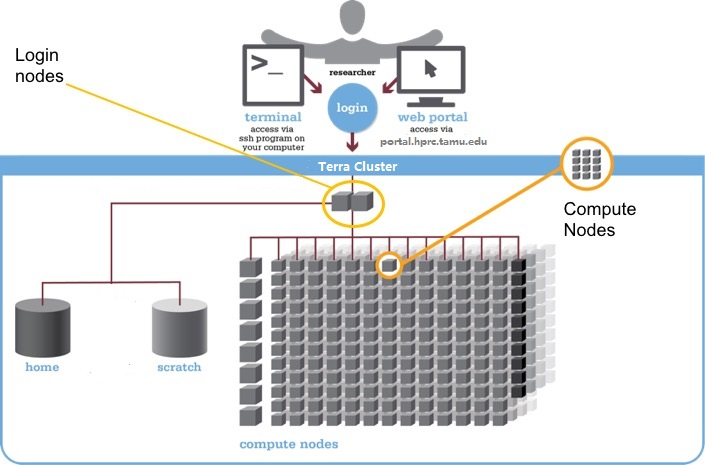

The words "cloud", "cluster", and "high-performance computing" get thrown around a lot.
So what do they mean exactly?
And more importantly, how do we use them for our work?

The "cloud" is a generic term commonly used to refer to remote computing resources.
Cloud can refer to webservers, remote storage, API endpoints, and as well as more traditional "raw compute" resources. 
A cluster on the other hand, is a term used to describe a network of compters.
Machines in a cluster typically share a common purpose, 
and are used to accomplish tasks that might otherwise be too substantial for any one machine. 


## High performance computing cluster

A high-performance computing cluster is a set of machines that have been 
designed to handle tasks that normal computers can't handle.
This doesn't always mean simply having super fast processors. 
High-performance computing covers a lot of use cases.
Here are a couple of use cases where high-performance computing becomes extremely useful:

* You need access to large numbers of CPUs.
* You need to run a large number of jobs.
* Your jobs are running out of memory.
* Perhaps you need to store tons and tons of data.
* You require an exceptionally high-bandwidth internet connection for data transfer.
* You need a safe archival site for your data.
* Your compute jobs require specialized GPU or FPGA hardware.
* Maybe your jobs just take a long time to run.

Chances are, you've run into one of these situations before.
Fortunately, high-performance computing installations exist to solve these types of problems.


## Logging onto the cluster

You should be logged into OnDemand, we will open a terminal window from the Dashboard. Use the Clusters pulldown menu
and choose "Terra Shell Access".

## Where are we? 

Very often, many users are tempted to think of a high-performance computing installation as one giant, magical machine.
Sometimes, people even assume that the machine they've logged onto is the entire computing cluster.
So what's really happening? What machine have we logged on to?
The name of the current computer we are logged onto can be checked with the `hostname` command.


```
hostname
```
{: .bash}
```
tlogin-0502.cluster
```
{: .output}

Clusters have different types of machines customized for different types of tasks.
In this case, we are on a login node.
A login node serves as a gateway to the cluster and serves as a single point of access.
As a gateway, it is well suited for uploading and downloading files, setting up software, and running quick tests.
It should never be used for doing actual work. Login nodes only have 1 hour CPU time.

The real work on a cluster gets done by the compute nodes.
Compute nodes come in many shapes and sizes, but generally are dedicated to doing all of the heavy lifting that needs doing. 
All interaction with the compute nodes is handled by a specialized piece of software called a scheduler. We use the LSF on Ada and Slurm on Terra.
We can view all of the worker nodes with the `lshosts` command on Ada and `sinfo -o %n` on Terra. Below is an example on Terra.

```
sinfo -o %n |more
```
{: .bash}
```
HOSTNAMES
tgpu-0807
tgpu-0816
tgpu-0831
tgpu-0834
tgpu-0835
tgpu-0836
tnxt-0301
tnxt-0302
tnxt-0303
tnxt-0304
tnxt-0306
tnxt-0307
tnxt-0309
tnxt-0310
tnxt-0311
tnxt-0312
tnxt-0313
tnxt-0314
tnxt-0315

```
{: .output}



This graphic is a general view of the parts of a cluster. For specific details on the clusters at TAMU HPRC, check out our 
[Ada user guide](https://hprc.tamu.edu/wiki/Ada:Intro) and [Terra user guide](https://hprc.tamu.edu/wiki/Terra:Intro).

## File Systems

There are two different file systems you can use on our clusters. They are optimized for different purposes so it is
important to know the differences between them.

| Filesystem | Quota | Backed up? |
| --- | --- | --- | --- |
| Home ($HOME) | 10GB | Yes | 
| Scratch ($SCRATCH) | 1T | No | 

Home directory quota is a hard limit, so keep an eye on your usage. When you log on to the system, you'll see a daily
quota display, like this:

```
Your current disk quotas are:
Disk       Disk Usage      Limit    File Usage      Limit
/home          2.952G        10G        123889     500000
/scratch       255.3G        10T       1039927    4000000
```
{: .output}

You can also run `showquota` to see your quota. It will display the same information as shown above.

## Moving files to and from the remote system from and to your local computer

It is often necessary to move data from your local computer to the remote system and vice versa.  

If you are on a Windows machine, you will need [WinSCP](https://winscp.net/eng/index.php) or [FileZilla](https://filezilla-project.org) to transfer files between your local machine and a remote cluster.

If you are on a Linux machine or Mac,  there are many ways to do this and we will look at two here: `scp` and `sftp`.

### `scp` from your local computer to the remote system
The most basic command line tool for moving files around is secure copy or `scp`.

`scp` behaves similarily to `ssh` but with one additional input, the name of the file to be copied.  Log no to Terra use one of the methods we have learned (ssh, putty, ondemand shell access). List files in your home directory.
```
ls
```
{: .bash}

Pick one file and copy it to your account on Ada with `scp`.
	
~~~
[Terra] scp fileToMove username@Ada.tamu.edu:
~~~
{: .bash}
	
It should be expected that a password will be asked for and you should be prepared to provide it.

Once the transfer is complete you should be able to use `ssh` to login to Ada and see your file in your home directory.

~~~
[Ada]$ ls
~~~
{: .bash}

~~~
...
fileToMove
...
~~~
{: .output}

## File transfer using OnDemand

The file manager application in OnDemand allows you to manage your files in a graphical format. You can copy, move, edit, 
and transfer files easily. You can also navigate your filesystem by using your mouse. The path will always be displayed 
at the top of the window. The file transfer tool is especially easy to use for transfering files from your computer to the 
cluster by dragging and dropping or using the upload and download buttons.

> ## Transfer files to the cluster
> We want to put the job script files on your home directory using the OnDemand file browser. You can get these files in the 
> setup page of this workshop. Make sure to unzip them, there should be two files `sleep.sh` and `poisson.sh`.
> 
> Open your scratch Directory in the OnDemand file browser. 
>
> Make a new directory called `IntroHPC`. Inside the directory `IntroHPC`, make a new directory `sleep` and another called `poisson`.
>
> Put the `sleep.sh` file in the `sleep` directory and the `poisson.sh` file in the `poisson` directory. You can do 
> this with the upload button or just drag and drop the files into the browser.
>
> *NB: Always name directories and files with no spaces! Otherwise, Linux may not interpret this as one object.*
{: .challenge}


## Grabbing files from the Internet

To download files from the Internet, 
the absolute best tool is `wget`.
The syntax is relatively straightforward: `wget https://some_url/file.tar.gz`

> ## Downloading poisson-mpi.exe.tgz
> Download the executable for poisson.sh from [https://github.com/luop0812/HPRC_IntroHPC/blob/master/poisson-mpi.exe.tgz](https://github.com/luop0812/HPRC_IntroHPC/blob/master/poisson-mpi.exe.tgz)
> Download it to the cluster with `wget`.
>
{: .challenge}

> ## Working with compressed files, using unzip and gunzip
> 
> The file we just downloaded is gzipped (has the `.gz` 
> extension).
>You can uncompress it with `gunzip filename.gz`.
>
>File decompression reference:
>
>* **.tgz** - `tar -xzvf archive-name.tar.gz`
>* **.tar.gz** - `tar -xzvf archive-name.tar.gz`
>* **.tar.bz2** - `tar -xjvf archive-name.tar.bz2`
>* **.zip** - `unzip archive-name.zip`
>* **.rar** - `unrar archive-name.rar`
>* **.7z** - `7z x archive-name.7z`
>
>However, sometimes we will want to compress files 
>ourselves to make file transfers easier.
>The larger the file, the longer it will take to 
>transfer. 
>Moreover, we can compress a whole bunch of little 
>files into one big file to make it easier
>on us (no one likes transferring 70000) little files!
>
>The two compression commands we'll probably want to 
>remember are the following:
>
>* Compress a single file with Gzip - `gzip filename`
>* Compress a lot of files/folders with Gzip - `tar -czvf archive-name.tar.gz folder1 file2 folder3 etc`
> 
{: .callout}
