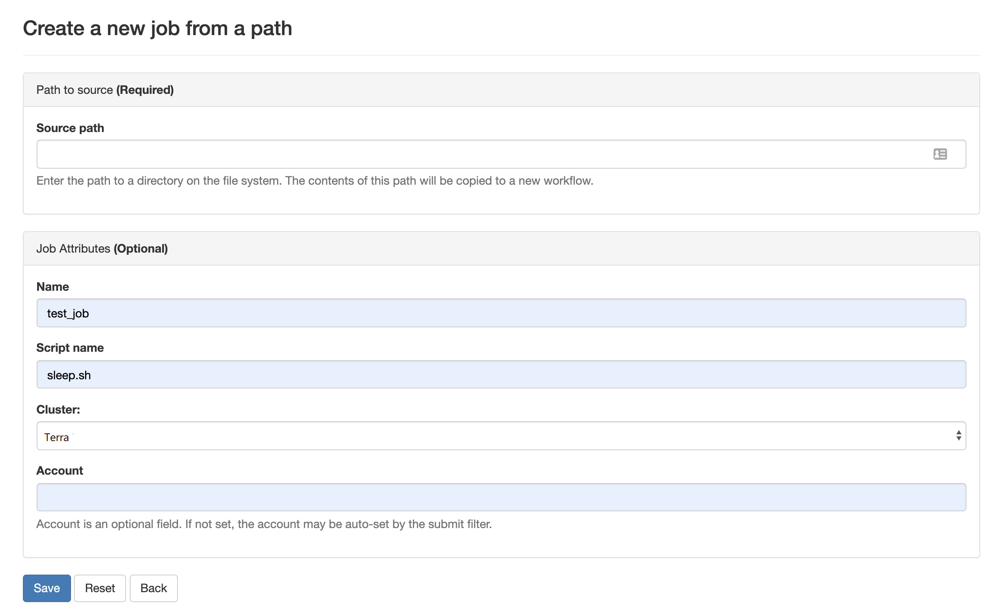

An HPC system might have thousands of nodes and thousands of users.
How do we decide who gets what and when?
How do we ensure that a task is run with the resources it needs?
This job is handled by a special piece of software called the scheduler.
On an HPC system, the scheduler manages which jobs run where and when.

The scheduler used in this lesson is Slurm on Terra.
The batch schduler used on Ada is LSF. Although we have two different schedulers, 
running jobs is quite similar regardless of what software is being used. 
The exact syntax might change, but the concepts remain the same.

In the following presentation, we will use Slurm to illustrate the various concepts related to batch jobs. 
After that, we will show the comparison between Slurm and LSF so that you can learn how to use LSF easily.  

## Running a batch job

In section 2, we learned how to run a command next to the command line prompt. This is called to run a command interactively.
The most basic use of the scheduler is to run a command non-interactively. 
This is also referred to as batch job submission. 
In this case, we need to make a script that incorporates some arguments for Slurm such as resources needed and modules to load. 

We will use the sleep.sh job script as an example.

### Job Specifications

Let's discuss the example Slurm script.
```
sleep.sh
```
```
#!/bin/bash
#SBATCH --job-name=test_script
#SBATCH --time=00:03:00
#SBATCH --ntasks=1
#SBATCH --mem=2560M
#SBATCH --output=test.out

echo 'This script is running on:'
hostname
echo 'The date is :'
date
sleep 120
```

Comments in UNIX (denoted by `#`) are typically ignored.
But there are exceptions.
For instance the special `#!` comment at the beginning of scripts
specifies what program should be used to run it (typically `/bin/bash`).
Schedulers like Slurm also have a special comment used to denote special 
scheduler-specific options.
Though these comments differ from scheduler to scheduler, 
Slurm's special comment is `#SBATCH`.
Anything following the scheduler's special comment is interpreted as an instruction to the scheduler.

In our example, we have set the following job parameters:
 
| Flag | Name | Example Setting | Notes|
| --- | --- | --- | --- |
| --job-name | jobname| test_script | Name of your script (no spaces, alphanumeric only) |
| --time | walltime | 00:03:00 | set the job total walltime to three minutes. |
| --ntasks | number of tasks| 1 | set number of tasks (or cores) for the job. |
| --mem| memory per node | 2560M | set total memory per node. |
| --output | job output file name| test.out | set the name of the output file |

#### Walltime
Walltime is represented by `walltime=00:03:00` in the format HH:MM:SS. This will be how long the job will run before timing out.  If your job exceeds this time the scheduler will terminate the job. It is recommended to find a usual runtime for the job and add some more (say 20%) to it. For example, if a job took approximately 10 hours, the walltime limit could be set to 12 hours, e.g. "-l walltime=12:00:00". By setting the walltime the scheduler can perform job scheduling more efficiently and also reduces occasions where errors can leave the job stalled but still taking up resource for the default much longer walltime limit.

Resource requests are typically binding.
If you exceed them, your job will be killed.
Let's use walltime as an example.
We will request 30 seconds of walltime, 
and attempt to run a job for two minutes.

> ## Editing walltime in sleep.sh 
>
> Edit sleep.sh using the editor from the OnDemand portal and change the walltime to 30 seconds. 
{: .challenge}

```
#!/bin/bash
#SBATCH --job-name=test_script
#SBATCH --time=00:00:30
#SBATCH --ntasks=1
#SBATCH --mem=2560M
#SBATCH --output=test.out
#SBATCH --account=123456

echo 'This script is running on:'
hostname
echo 'The date is :'
date
sleep 120
```

Submit the job with `sbatch sleep.sh` and wait for it to finish. 
Once it is finished, check the output file `test.out`, there will be
```
slurmstepd: error: *** JOB 2554410 ON tnxt-0715 CANCELLED AT 2019-05-09T00:28:24 DUE TO TIME LIMIT ***
```

Our job was killed for exceeding the amount of resources it requested.
Although this appears harsh, this is actually a feature.
Strict adherence to resource requests allows the scheduler to find the best possible place
for your jobs.
Even more importantly, 
it ensures that another user cannot use more resources than they've been given.
If another user messes up and accidentally attempts to use all of the CPUs or memory on a node, 
Slurm will either restrain their job to the requested resources or kill the job outright.
Other jobs on the node will be unaffected.
This means that one user cannot mess up the experience of others,
the only jobs affected by a mistake in scheduling will be their own.

#### Node, CPU, Processor, Core
There are some terms we need to know to help us understand the parameters used in batch schedulerss.
A node refers to a computer in the cluster (remember, a cluster consists of many computers). 
CPU stands for Central Processing Unit. There are single core CPUs (which is rare nowadays) and multiple core CPUs. 
A core is the smallest processing unit in a CPU. A processor is usually referred to as a core. 

For example, each Terra node contains dual CPUs and each CPU contains 14 cores, and each Ada node contains dual CPUs and each CPU contains 10 cores.
So each Terra node has total 28 cores, while each Ada node has total 20 cores. 

But, sometimes, all three terms( CPU, processor, and core) mean a processor, especially in batch scheduler terminology.

## Submitting Jobs via command line

To submit this job to the scheduler, we use the `sbatch` command.

```
[username@terra2 ~]$ sbatch sleep.sh
Submitted batch job 2554410
(from job_submit) your job is charged as below
              Project Account: 122841013305
              Account Balance: 3842.716837
              Requested SUs:   0.033333333333333
[username@terra2 ~]$ 
```
The number that appears last in the first line is your Job ID. When the job is completed, you will one file generated by Slurm. The output file contains standard out and standard error generated by the run of your job. We will see how to specify separate standard out and standard error later in the segment 'Comparison between Slurm and LSF'.

And that's all we need to do to submit a job. 
To check on our job's status, we use the command `squeue -u username`

```
[username@terra2 ~]$ squeue -u username
JOBID        NAME                 USER             PARTITION    NODES  CPUS  STATE        TIME         TIME_LEFT    START_TIME         REASON                   NODELIST
2554410      test_script          username         short        1      1     RUNNING      0:38         0:22         2019-05-09T00:26:5 None                     tnxt-0715
```
{: .output}

We can see all the details of our job, most importantly if it is in "RUNNING" state.
Sometimes our jobs might need to wait in a queue ("QUEUED") or have an error.
The best way to check our job's status is with `squeue`. It is easiest to view just your own jobs
in the queue with the `squeue -u username`. Otherwise, you get all the jobs in the queues.

## Queues

There are usually a number of available queues to use on your HPC. Remember: Each cluster has separate queues. 
However, on Ada or Terra, we don't specify a queue unless our job need a special queue. The scheduler will route 
any job to the queue that fits the job's specifications. 

Special queues include xlarge, gpu, and vnc etc. To use a special queue, you need to add `#SBATCH --partition=[queuename]`.


> ## Submitting resource requests
>
> Submit a job that will use 1 node, 14 processors, and 5 minutes of walltime.
{: .challenge}


## Job environment variables

Slurm sets multiple environment variables at submission time. The following Slurm variables are commonly used in command files: 


| Variable Name |  Description | Example Values |
|---|---|---|
| SLURM_JOB_ID| Containss Slurm job id|2554410 |     
| SLURM_JOB_NODEFILE|  Contains a list of the nodes assigned to the job.  | tnxt-[0465-0466,0468-0469] |


> ## Quick Reference
>A good reference for these and other PBS variables is part of our [Batch Processing at OSC](https://www.osc.edu/supercomputing/batch-processing-at-osc) pages under [Batch-Related Command Summary](https://www.osc.edu/supercomputing/batch-processing-at-osc/batch-related-command-summary).
{: .callout}

## Canceling a job


Sometimes we'll make a mistake and need to cancel a job.
This can be done with the `cancel` command.
Let's submit a job and then cancel it using its job number.

```
[username@terra2 ~]$ sbatch sleep.sh
Submitted batch job 2554410
(from job_submit) your job is charged as below
              Project Account: 122841013305
              Account Balance: 3842.716837
              Requested SUs:   0.033333333333333

[username@terra2 ~]$ squeue -u username
JOBID        NAME                 USER             PARTITION    NODES  CPUS  STATE        TIME         TIME_LEFT    START_TIME         REASON                   NODELIST
2554410      test_script          username         short        1      1     RUNNING      0:38         0:22         2019-05-09T00:26:5 None                     tnxt-0715

```

Now cancel the job with it's job number. 
Absence of any job info indicates that the job has been successfully canceled.

```
[username@terra2 ~]$ scancel 2554410
[username@terra2 ~]$ squeue -u username
[username@terra2 ~]$ 
```

## Comparison between Slurm and LSF

### Job Specifications
| Option | Slurm  |  LSF |
|---|---|---|
Directive | #SBATCH | #BSUB |
node count| -N,--nodes=<minnodes[-maxnodes]> | N/A |
core count| -n, --ntasks=<count> | -n <count> |
tasks per node | --ntasks-per-node=<count> | -R "span[ptile=count]"
wall clock limit| -t, --time=<days-hh:mm:ss> or <hh:mm:ss> | -W [hh:mm] |
memory per core|  --mem-per-cpu=<size[units]> (unit is M/G/T) |-M <size> -R "rusage[mem=size]"|
memory per node|N/A |  --mem=<size[units]>|
queue | -p, --partition=<queuename> | -q <queuename> |

### User Commands

### Environment Variables
| Variable Name |  Description | Example Values |
|---|---|---|

Click [here](https://hprc.tamu.edu/wiki/TAMU_Supercomputing_Facility:HPRC:Batch_Translation) to learn more about the comparison.

You can find out more information about these parameters by viewing the manual page of `sbatch` on Terra and `bsub` on Ada. 

```
username@terra2 ~]$ man sbatch
```
```
username@ada1 ~]$ man bsub
```

### Interactive jobs

Sometimes, you will need a lot of resource for interactive use.
Perhaps it's the first time running an analysis 
or we are attempting to debug something that went wrong with a previous job.
Fortunately, PBS makes it easy to start an interactive job with `qsub -I`:

```
qsub -I -A PZSXXX -l nodes=1:ppn=28 -l walltime=00:01:00 
```
{: .bash}

You can also request interactive jobs on OnDemand using the Interative Apps menu and select the vnc app.

## Submit Jobs with Job Composer on OnDemand

OnDemand also has a tool for job creation and submission to the batch system. The same information as above applies since
it still uses the same underlying queue system. In the Job Composer, you can create a new location in your home directory
for a new job, create or transfer a job script and input files, edit everything, and submit your job all from this screen.

We will run this job in the Job Composer by creating a new job from _specified path_.


You'll see the Job Options page, like this:



Fill it in as shown. You need to fill in your own path and then select Save.


To run the job, select green 'play' button.

If job successfully submitted, a green bar will appear on the top of the page.

Also, OnDemand allows you to view the queue for all systems (not just the one you are on in the shell) under Jobs, select
Active Jobs. You can filter by your jobs, your group's jobs, and all jobs.
> ## Submit a job from a template in the Job Composer
>
> Find MPI Hello World job in the templates
>
> Edit the job script to correct the project number
>
>Submit job and view results
{: .challenge}


## View Job Status with Active Jobs on OnDemand
