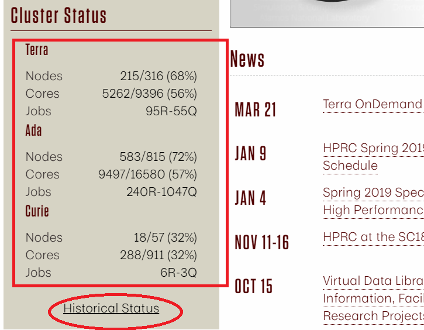

We now know virtually everything we need to know about getting stuff on a cluster.
We can log on, submit different types of jobs, use preinstalled software, 
and install and use software of our own.
What we need to do now is use the systems effectively.

## How do you choose which cluster to use?

At HPRC, we have four clusters: Ada, Terra, Curie, and Lonestar. Ada, Terra, Curie are the two clusters operated by us and Lonestar
is operated by TACC. Most of our users use Ada and/or Terra. But what are the differences between Ada and Terra, and how do you decide which one to use?  
Ada is larger but older, while Terra is smaller but newer. Ada has 20 cores per node and Terra has 28 cores per node. Ada uses LSF batch scheduler, while Terra uses Slurm. 
Otherwise, the two systems are similar.  
You can switch between them pretty easily so you don't have to commit to one forever. 
Often it is a question of how busy they are. 
To switch between Ada and Terra, one thing you need to do is to convert your batch script. You may also need to recompile your program if your use your own code.  

The current utilization of each cluster can be found at HPRC [homepage](hprc.tamu.edu):


We can also check the historical status within a period of time by clicking ['Historical Status'](https://hprc.tamu.edu/stats/history.html)
## Estimating required resources using the scheduler

Although we covered requesting resources from the scheduler earlier,
how do we know how much and what type of resources we will need in the first place?

Answer: we don't. 
Not until we've tried it ourselves at least once.
We'll need to benchmark our job and experiment with it before
we know how much it needs in the way of resources.

The most effective way of figuring out how much resources a job needs is to submit a test job,
and then ask the scheduler how many resources it used.
A good rule of thumb is to ask the scheduler for more time and memory than your job can use.
This value is typically two to three times what you think your job will need.

> ## Benchmarking `poisson-mpi.exe`
> Create a job that runs the following command 
> ```
> module load intel/2018b
> mpirun ./poisson-mpi.exe <<BEGIN
> 800
> 10000000
> BEGIN
> ```
> {: .bash}
> 
> Let's request for 4 cores, 10G memory per node, and 1 hour walltime 
> You'll need to figure out a good amount of resources to ask for for this first "test run".
{: .challenge}

Once the job completes, we can check resources used. 

> ## Checking resources used
> With Slurm, we use sacct to check the actual walltime and memory spent by a finished job. 
> ```
> [username@terra1 poisson]$ sacct -j  2583373 --format="JobID,Elapsed,MaxRSS"
>       JobID    Elapsed     MaxRSS
> ------------ ---------- ----------
> 2583373        00:02:28
> 2583373.bat+   00:02:28      1048K
> 2583373.ext+   00:02:28       980K
> 2583373.0      00:02:22     57560K
> 
> ```
> {: .bash}
> For sure we have requested way too much memory and walltime. Now modify the job script and reduce the resources to at most three times what we have got from the test.
>
> LSF will write the actually walltime and memory used in the job standard output file. Checking the end of that file you will find out how much memory and wall time were actually used.
> Successfully completed.
> ```
> Resource usage summary:

>     CPU time :                                   670.12 sec.
>     Max Memory :                                 33 MB
>     Average Memory :                             31.76 MB
>     Total Requested Memory :                     4000.00 MB
>     Delta Memory :                               3967.00 MB
>     Max Swap :                                   1 MB
>     Max Processes :                              10
>     Max Threads :                                11
> 
> The output (if any) is above this job summary.
> ```
> {:.bash}
{: .challenge}


## Do not run jobs on the login nodes

The example above was a small process that can be run on the login node without too much disruption. However, it
is good practice to avoid running anything resource intensive on the login nodes. There is a hard limit 
60 minutes, anything longer will be automatically stopped.

## Playing nice in the sandbox

You now have everything you need to run jobs, transfer files, use/install software,
and monitor how many resources your jobs are using.

So here are a couple final words to live by:

* Don't run jobs on the login node, though quick tests are generally fine. 
  A "quick test" is generally anything that uses less than 1GB of memory, and 20 minutes of time.
  Anything larger will be automatically killed by the system. Remember, the login node is to 
  be shared with other users. 

* Compress files before transferring to save file transfer times with large datasets.

* Use a VCS system like git to keep track of your code. Though most systems have some form
  of backup/archival system, you shouldn't rely on it for something as key as your research code.
  The best backup system is one you manage yourself.

* Before submitting a run of jobs, submit one as a test first to make sure everything works.

* The less resources you ask for, the faster your jobs will find a slot in which to run.
  The more accurate your walltime is, the sooner your job will run.

* You can generally install software yourself, but if you want a shared installation of some kind,
  it might be a good idea to email OSCHelp@osc.edu.

* Always use the default compilers if possible. Newer compilers are great, but older stuff generally
  means that your software will still work, even if a newer compiler is loaded.

